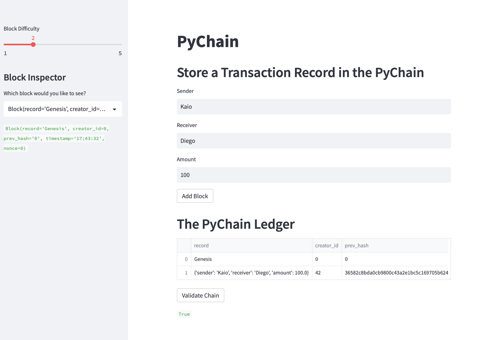
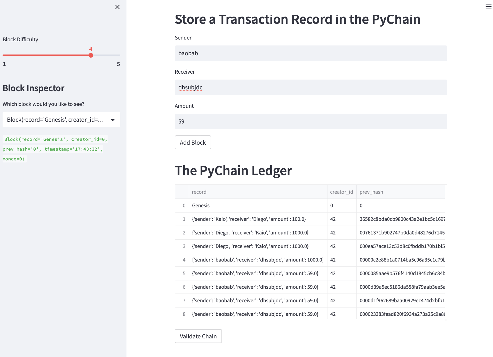

# Blockchain

### For the following project, I developed an user-friendly interface that is a blockchain-based ledger system. This ledger simulates financial transactions, between a sender and receiver. The ledger also verifies the integrity of the data in the ledger and let you validate it.

# How to run the code

### In order to run the web interface, you must first download the libraries;
- pandas
- streamlit
- dataclasses
- datetime
- hashlib
- typing

# Running the Web interface

### Once you installed and the libraries required, your next step is to go to your terminal, go to the folder where the code is located and then type;
```
streamlit run pychain.py
```

# Pychain Web Interface

### By the time you run the code locally, this is how the web interface will look like; 


### You can always play around and change the block dificulty, check others block and even validate the chain. Everytime a new block is added, the pychain ledger is able to memorize and display to the users. 

